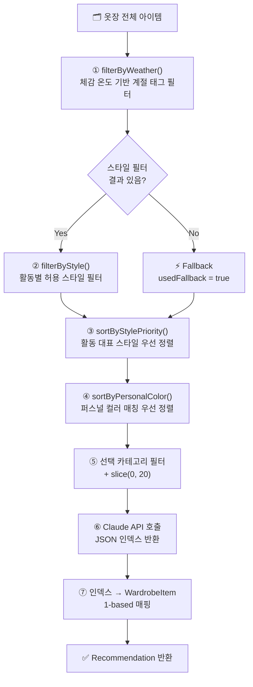

<div align="center">

# 🌤️ 몇 도야? (myeotdoya) — 코드 이해 문서

**내 옷장에서 오늘의 날씨를, 오늘의 옷차림으로.**  
매일 아침 5분을 당신께 돌려드립니다.

[](https://nextjs.org/)
[](https://www.typescriptlang.org/)
[](https://tailwindcss.com/)
[](https://supabase.com/)
[](https://anthropic.com/)

*작성일: 2026-06-10*

</div>

---

## 📋 목차

| # | 섹션 |
|---|------|
| 1 | [프로젝트 개요](#1-프로젝트-개요) |
| 2 | [기술 스택](#2-기술-스택) |
| 3 | [디렉토리 구조](#3-디렉토리-구조) |
| 4 | [환경 변수](#4-환경-변수) |
| 5 | [타입 시스템](#5-타입-시스템) |
| 6 | [데이터베이스 스키마](#6-데이터베이스-스키마-supabase) |
| 7 | [상수 & 설정](#7-상수--설정-constantsts) |
| 8 | [인증 흐름](#8-인증-흐름) |
| 9 | [페이지별 상세 설명](#9-페이지별-상세-설명) |
| 10 | [API 라우트 상세](#10-api-라우트-상세) |
| 11 | [추천 알고리즘 상세](#11-추천-알고리즘-상세) |
| 12 | [공유 컴포넌트](#12-공유-컴포넌트) |
| 13 | [스타일링 & 디자인 시스템](#13-스타일링--디자인-시스템) |
| 14 | [데이터 흐름 전체 시나리오](#14-데이터-흐름-전체-시나리오) |
| 15 | [주요 비즈니스 로직 정리](#15-주요-비즈니스-로직-정리) |

---

## 1. 프로젝트 개요

> 사용자가 등록한 자신의 옷장 사진을 기반으로, 오늘의 날씨 + 외출 목적 + 퍼스널 컬러를 조합해 Claude AI가 최적의 코디를 추천해주는 서비스.

**주요 기능 4가지**

| # | 기능 | 설명 |
|---|------|------|
| 🌡️ | **날씨 감지** | GPS 자동 감지 또는 도시명 / 수동 온도 입력 |
| 👗 | **옷장 관리** | 옷 사진 업로드 → Claude AI 자동 분석 (카테고리, 색상, 스타일 등) |
| 🤖 | **AI 코디 추천** | Claude Sonnet이 날씨·활동·퍼스널컬러·스타일 선호를 종합해 코디 조합 선택 |
| 💬 | **스타일리스트 코멘트** | 선택 이유를 4가지 관점(날씨/활동/퍼스널컬러/스타일)으로 설명 |

---

## 2. 기술 스택

| 분야 | 기술 | 버전 | 역할 |
|------|------|------|------|
| 프레임워크 | Next.js | 15.3.3 | App Router, SSR/CSR 혼합 |
| UI 라이브러리 | React | 19.0.0 | 컴포넌트 기반 UI |
| 언어 | TypeScript | 5.x | 타입 안전성 |
| 스타일링 | Tailwind CSS | 3.4.17 | 유틸리티 퍼스트 CSS |
| 백엔드/DB | Supabase | 2.50.0 | PostgreSQL + 스토리지 + Auth |
| AI | Claude (Anthropic SDK) | 0.52.0 | `claude-sonnet-4-6` 모델 |
| 날씨 | OpenWeather API | v2.5 | 실시간 날씨 정보 |
| 폰트 | Pretendard | CDN | 한국어 최적화 산세리프 |

```bash
npm run dev    # 개발 서버 (localhost:3000)
npm run build  # 프로덕션 빌드
npm run start  # 프로덕션 서버
npm run lint   # ESLint 검사
```

---

## 3. 디렉토리 구조

```
weather/
├── src/
│   ├── app/
│   │   ├── layout.tsx                # 루트 레이아웃 (메타데이터, PWA, 폰트)
│   │   ├── page.tsx                  # 홈 페이지 — 날씨 입력 + 활동 선택
│   │   ├── globals.css               # 전역 스타일
│   │   ├── api/
│   │   │   ├── weather/route.ts      # OpenWeather API 프록시
│   │   │   ├── wardrobe/
│   │   │   │   ├── route.ts          # 옷장 CRUD
│   │   │   │   └── analyze/route.ts  # Claude AI 이미지 분석
│   │   │   └── recommend/route.ts    # Claude AI 코디 추천 엔진
│   │   ├── auth/callback/route.ts    # OAuth 콜백 처리
│   │   ├── onboarding/page.tsx       # 5단계 프로필 설정
│   │   ├── settings/page.tsx         # 프로필 편집
│   │   ├── wardrobe/
│   │   │   ├── page.tsx              # 옷장 갤러리
│   │   │   ├── add/page.tsx          # 옷 추가 (이미지 업로드 + AI 분석)
│   │   │   └── edit/[id]/page.tsx    # 옷 수정
│   │   └── result/page.tsx           # 코디 추천 결과
│   ├── components/
│   │   └── TopNav.tsx
│   ├── lib/
│   │   ├── constants.ts              # 앱 전체 상수 중앙 관리
│   │   └── supabase/
│   │       ├── client.ts             # 브라우저용 클라이언트
│   │       └── server.ts             # 서버용 클라이언트 (쿠키 기반)
│   ├── types/index.ts                # TypeScript 타입 정의
│   └── middleware.ts                 # Supabase 세션 갱신
├── next.config.ts
├── tailwind.config.ts
└── .env.example
```

---

## 4. 환경 변수

`.env.local` 파일에 아래 변수들을 설정해야 한다.

```env
# Supabase 프로젝트 URL (공개 가능)
NEXT_PUBLIC_SUPABASE_URL=https://xxxx.supabase.co

# Supabase 익명 키 (공개 가능, RLS로 보호됨)
NEXT_PUBLIC_SUPABASE_ANON_KEY=eyJ...

# Supabase 서비스 롤 키
SUPABASE_SERVICE_ROLE_KEY=eyJ...

# OpenWeather API 키
OPENWEATHER_API_KEY=abc123...

# Anthropic API 키 (Claude AI)
ANTHROPIC_API_KEY=sk-ant-...
```

> [!WARNING]
> `SUPABASE_SERVICE_ROLE_KEY`는 절대 클라이언트 코드에 노출하면 안 됩니다. `NEXT_PUBLIC_` 접두사 없이 서버 전용으로만 사용하세요.

---

## 5. 타입 시스템

**파일:** [`src/types/index.ts`](src/types/index.ts) — 모든 핵심 타입이 단일 파일에 정의되어 있다.

### 기본 Union Types

```typescript
type PersonalColor = 'spring_warm' | 'summer_cool' | 'autumn_warm' | 'winter_cool'
type Gender        = 'male' | 'female' | 'neutral'
type Category      = 'top' | 'bottom' | 'outer' | 'shoes' | 'accessory'
type Season        = 'spring' | 'summer' | 'autumn' | 'winter' | 'all_season'
type Activity      = 'daily' | 'office' | 'formal' | 'active' | 'date' | 'nightout'
type Style         = 'casual' | 'formal' | 'sporty' | 'street' | 'minimal' | 'vintage'
                   | 'chic' | 'girly' | 'boyish' | 'classic' | 'romantic' | 'preppy'
```

### 주요 인터페이스

<details>
<summary><b>Profile</b> — 사용자 프로필</summary>

```typescript
interface Profile {
  id: string
  personal_color: PersonalColor
  gender: Gender
  liked_styles: string[]     // 최대 3개
  disliked_styles: string[]  // 최대 3개
  created_at: string
}
```
</details>

<details>
<summary><b>WardrobeItem</b> — 옷장 아이템</summary>

```typescript
interface WardrobeItem {
  id: string
  user_id: string
  image_url: string          // Supabase Storage 공개 URL
  category: Category
  colors: string[]           // 예: ['네이비', '화이트']
  style: Style[]
  material: string | null
  season: Season[]
  description: string | null
  created_at: string
  deleted_at: string | null  // null = 활성, 값 있음 = 소프트 삭제
}
```
</details>

<details>
<summary><b>Recommendation</b> — 코디 추천 결과</summary>

```typescript
interface Recommendation {
  top: WardrobeItem | null
  bottom: WardrobeItem | null
  outer: WardrobeItem | null
  shoes: WardrobeItem | null
  accessories: WardrobeItem[]
  reason: string             // 4단락 추천 이유 (\n으로 구분)
  tips: string[]
  usedFallback: boolean      // 스타일 필터 없이 날씨만으로 선택했는지
  missingCategories: Category[]
  allMissing: boolean
}
```
</details>

---

## 6. 데이터베이스 스키마 (Supabase)

### `profiles` 테이블

| 컬럼 | 타입 | 설명 |
|------|------|------|
| `id` | uuid (PK) | `auth.users.id`와 동일 |
| `personal_color` | text | PersonalColor 값 |
| `gender` | text | Gender 값 |
| `liked_styles` | text[] | 선호 스타일 배열 |
| `disliked_styles` | text[] | 기피 스타일 배열 |
| `created_at` | timestamptz | 생성 시각 |

### `wardrobe` 테이블

| 컬럼 | 타입 | 설명 |
|------|------|------|
| `id` | uuid (PK) | 자동 생성 |
| `user_id` | uuid (FK) | profiles.id 참조 |
| `image_url` | text | Supabase Storage 공개 URL |
| `category` | text | Category 값 |
| `colors` | text[] | 색상 배열 |
| `style` | text[] | 스타일 배열 |
| `material` | text | 소재 |
| `season` | text[] | 계절 배열 |
| `description` | text | AI 생성 또는 사용자 수정 설명 |
| `created_at` | timestamptz | 생성 시각 |
| `deleted_at` | timestamptz | 소프트 삭제 시각 (`null` = 활성) |

### Storage & RLS

- **버킷:** `wardrobe-images` (공개) — 경로: `{user_id}/{timestamp}.{ext}`
- **RLS:** 모든 쿼리는 `user_id = auth.uid()` 조건으로 본인 데이터만 접근 가능

---

## 7. 상수 & 설정 (`constants.ts`)

**파일:** [`src/lib/constants.ts`](src/lib/constants.ts) — 앱 전체 레이블·설정·비즈니스 로직 상수를 중앙 관리한다.

### 활동별 허용 스타일 (핵심 비즈니스 로직)

| 활동 | 허용 스타일 |
|------|------------|
| `formal` | formal, classic, chic |
| `office` | formal, minimal, classic, preppy |
| `daily` | casual, street, minimal, vintage, boyish, chic, classic, preppy, romantic, girly |
| `active` | sporty **only** |
| `date` | romantic, girly, chic, minimal, casual |
| `nightout` | romantic, chic, street, girly, formal |

### 퍼스널 컬러 추천 색상

| 타입 | 추천 색상 |
|------|----------|
| 봄 웜톤 | 코랄, 피치, 아이보리, 골드, 살구, 연노랑, 오렌지, 흰색 |
| 여름 쿨톤 | 라벤더, 로즈, 파우더블루, 실버, 연보라, 민트, 핑크, 흰색 |
| 가을 웜톤 | 카키, 브라운, 머스타드, 올리브, 테라코타, 베이지, 오트밀, 흰색 |
| 겨울 쿨톤 | 블랙, 네이비, 버건디, 화이트, 다크그린, 로열블루, 그레이 |

### 기온별 의류 가이드 (`TEMP_GUIDE`)

| 체감 온도 | 상의 | 하의 | 아우터 |
|-----------|------|------|--------|
| 28°C 이상 | 민소매, 반팔, 나시 | 반바지, 숏스커트 | — |
| 23~27°C | 반팔, 얇은 셔츠 | 면바지, 반바지 | — |
| 20~22°C | 긴팔, 얇은 니트 | 청바지, 면바지 | 얇은 가디건 |
| 17~19°C | 맨투맨, 니트 | 청바지, 슬랙스 | 가디건, 데님자켓 |
| 12~16°C | 두꺼운 니트 | 청바지, 슬랙스 | 자켓, 야상 |
| 9~11°C | 두꺼운 니트, 히트텍 | 두꺼운 슬랙스 | 트렌치코트 |
| 5~8°C | 히트텍, 두꺼운 니트 | 레깅스 | 코트, 가죽자켓 |
| 4°C 이하 | 히트텍, 기모 상의 | 기모 레깅스 | 패딩, 두꺼운 코트 |

> [!TIP]
> `buildWeatherGuide(feelsLike, weatherCondition, windSpeed)` — 비/눈/강풍 조건 추가 안내가 자동으로 포함됩니다.

---

## 8. 인증 흐름

### OAuth 콜백

```
Google 로그인
  → /auth/callback?code=xxx
  → exchangeCodeForSession(code)
  → profiles 테이블 조회
      ├─ 없음 → /onboarding?step=color  (신규 사용자)
      └─ 있음 → /                       (기존 사용자)
```

### 홈 페이지 인증 체크

```
페이지 로드 → supabase.auth.getUser()
  ├─ 미로그인 → /onboarding
  ├─ profiles 없음 → /onboarding?step=color
  └─ 정상 → authReady = true → 날씨 로딩 시작
```

### Supabase 클라이언트 종류

| 파일 | 사용 위치 | 생성 방법 |
|------|-----------|-----------|
| `client.ts` | `'use client'` 컴포넌트 | `createBrowserClient()` |
| `server.ts` | API Route, Server Component | `createServerClient()` + `cookies()` |

---

## 9. 페이지별 상세 설명

### 9.1 홈 페이지 `/` — [`src/app/page.tsx`](src/app/page.tsx)

**날씨 입력 3가지 방식**

1. **GPS 자동 감지** — `navigator.geolocation.getCurrentPosition()`
2. **도시명 검색** — 한국어 입력 시 `KO_TO_EN` 매핑으로 영어 변환 후 OpenWeather 호출 (31개 도시)
3. **수동 직접 입력** — 온도 숫자 + 맑음/흐림/비/눈/강풍 버튼

**추천 버튼 활성 조건**

```typescript
!!activity && !weatherLoading &&
(!!coords || !!cityQuery || isManualWeather) &&
selectedItems.length > 0 && !wardrobeEmpty
```

---

### 9.2 온보딩 `/onboarding` — [`src/app/onboarding/page.tsx`](src/app/onboarding/page.tsx)

```
step 0: intro    → 앱 소개 + Google 로그인
step 1: gender   → 남성 / 여성 / 무관
step 2: color    → 퍼스널 컬러 4가지 (컬러 스와치 UI)
step 3: like     → 좋아하는 스타일 최대 3개
step 4: dislike  → 싫어하는 스타일 최대 3개 → profiles.upsert() → /
```

> [!NOTE]
> 좋아요/싫어요는 상호 배타적 — 같은 스타일을 양쪽에 동시 선택 불가

---

### 9.3 설정 `/settings` — [`src/app/settings/page.tsx`](src/app/settings/page.tsx)

퍼스널 컬러·성별·스타일 선호 수정. `hasChanged` 상태로 변경 감지, 변경 없으면 저장 버튼 비활성.

---

### 9.4 옷장 갤러리 `/wardrobe` — [`src/app/wardrobe/page.tsx`](src/app/wardrobe/page.tsx)

5열 그리드 썸네일 + 카테고리 필터 + 클릭 시 모달(상세/수정/삭제).

**소프트 삭제** — 실제 레코드를 지우지 않고 `deleted_at` 필드를 설정한다.

```typescript
supabase.from('wardrobe')
  .update({ deleted_at: new Date().toISOString() })
  .eq('id', id).eq('user_id', user.id)
```

---

### 9.5 옷 추가 `/wardrobe/add` — [`src/app/wardrobe/add/page.tsx`](src/app/wardrobe/add/page.tsx)

```
① 이미지 선택 (JPEG/PNG/WEBP)
② 미리보기
③ "AI 분석" → POST /api/wardrobe/analyze
④ 폼 자동 채우기 (category, colors, style, material, season, description)
⑤ 사용자 수동 수정 가능
⑥ "저장" → POST /api/wardrobe → /wardrobe
```

---

### 9.6 옷 수정 `/wardrobe/edit/[id]` — [`src/app/wardrobe/edit/[id]/page.tsx`](src/app/wardrobe/edit/%5Bid%5D/page.tsx)

이미지는 변경 불가. 카테고리·스타일(최소 1개)·계절(최소 1개)·설명 수정 → `PATCH /api/wardrobe`.

---

### 9.7 결과 페이지 `/result` — [`src/app/result/page.tsx`](src/app/result/page.tsx)

```
┌─────────────────────┬──────────────────────┐
│   추천 코디 목록     │  스타일리스트 코멘트  │
│                     │                      │
│  👕 [상의] 이미지   │  🌡️ 날씨 기반 —     │
│  👖 [하의] 이미지   │  🎯 외출 목적 —      │
│  🧥 [아우터] 이미지 │  🎨 퍼스널 컬러 —   │
│  👟 [신발] 이미지   │  ✨ 스타일 선호도 —  │
│  💍 [액세서리]      │                      │
│                     │  📌 스타일링 팁       │
└─────────────────────┴──────────────────────┘
```

**아이템 없음 상태 구분**

| 상태 | 색상 | 의미 |
|------|------|------|
| `missing` | 🔴 빨간 점선 | 옷장에 해당 카테고리가 아예 없음 |
| `optional` | 🟠 주황 점선 | 선택했지만 매칭되는 아이템이 없음 |

---

## 10. API 라우트 상세

### `GET /api/weather` — [`src/app/api/weather/route.ts`](src/app/api/weather/route.ts)

| 파라미터 | 예시 | 설명 |
|----------|------|------|
| `lat`, `lon` | `?lat=37.5&lon=127.0` | 좌표 기반 |
| `city` | `?city=Seoul` | 도시명 기반 |

---

### `GET\|POST\|PATCH\|DELETE /api/wardrobe` — [`src/app/api/wardrobe/route.ts`](src/app/api/wardrobe/route.ts)

| 메서드 | 역할 | 요청 형식 |
|--------|------|----------|
| GET | 옷장 목록 조회 | — |
| POST | 옷 추가 | `multipart/form-data` (image + analysis JSON) |
| PATCH | 옷 수정 | JSON body |
| DELETE | 소프트 삭제 | `{ "id": "uuid" }` |

---

### `POST /api/wardrobe/analyze` — [`src/app/api/wardrobe/analyze/route.ts`](src/app/api/wardrobe/analyze/route.ts)

이미지 → Base64 → Claude 멀티모달 호출 → `ClothingAnalysis` 반환.

```json
{
  "category": "top",
  "colors": ["네이비", "흰색"],
  "style": ["casual", "minimal"],
  "material": "면",
  "season": ["spring", "autumn", "all_season"],
  "description": "네이비 스트라이프 반팔 티셔츠"
}
```

---

### `POST /api/recommend` — [`src/app/api/recommend/route.ts`](src/app/api/recommend/route.ts)

**입력:** `{ weather, activity, selectedItems? }`  
**처리:** 아래 섹션 11 참조  
**반환:** `Recommendation` 객체

---

## 11. 추천 알고리즘 상세

### 전체 파이프라인



### ① filterByWeather

```typescript
if (feelsLike >= 23) {
  // 포멀·오피스는 여름에도 슬랙스 등 봄·가을 허용
  allowed = (activity === 'formal' || activity === 'office')
    ? ['summer', 'spring', 'autumn', 'all_season']
    : ['summer', 'all_season']
} else if (feelsLike >= 10) {
  allowed = ['spring', 'autumn', 'all_season']
} else {
  allowed = ['winter', 'all_season']
}
```

### ④ sortByPersonalColor

```typescript
// 퍼스널 컬러 추천 색상과 아이템 colors 배열을 부분 문자열 매칭
preferred.some(p => c.toLowerCase().includes(p) || p.includes(c.toLowerCase()))
```

### ⑥ Claude 프롬프트 구조

<details>
<summary>프롬프트 예시 전체 보기</summary>

```
당신은 패션 스타일리스트입니다.

[날씨 정보]
- 기온: 18°C (체감 16°C) / 맑음 / 습도 45% / 풍속 3.2m/s

[기온별 추천 — 체감 16°C]
- 상의: 긴팔, 얇은 니트, 셔츠
- 하의: 청바지, 면바지, 슬랙스
- 아우터: 얇은 가디건

[오늘 활동]
데일리 — 친구 만남, 나들이 등 편안한 일상 외출.

[퍼스널 컬러]
봄 웜톤 (코랄, 피치, 아이보리, 골드 계열)

[스타일 선호도]
- 좋아하는 스타일: casual, minimal
- 절대 피해야 할 스타일: formal, sporty

[내 옷장 (12개)]
1. [top] 화이트+베이지 | casual+minimal | spring+autumn | 베이지 스트라이프 면 셔츠
2. [bottom] 네이비 | minimal | all_season | 와이드 데님 팬츠
...

JSON만 출력:
{
  "top_index": 숫자,
  "bottom_index": 숫자,
  "outer_index": null,
  "shoes_index": 숫자,
  "accessory_indices": [],
  "reason": "날씨 기반 — ...\n외출 목적 — ...\n퍼스널 컬러 — ...\n스타일 선호도 — ...",
  "tips": ["팁1", "팁2"]
}
```
</details>

---

## 12. 공유 컴포넌트

### TopNav — [`src/components/TopNav.tsx`](src/components/TopNav.tsx)

```
┌────────────────────────────────────────────┐
│  몇 도야?      홈  |  내 옷장  |  설정      │
└────────────────────────────────────────────┘
```

`usePathname()`으로 현재 경로 감지. 활성 라우트는 `text-accent` (초록 `#03C75A`) 강조.

---

## 13. 스타일링 & 디자인 시스템

### 커스텀 색상

| 변수 | HEX | 용도 |
|------|-----|------|
| `accent` | `#03C75A` | 주요 CTA 버튼, 활성 탭, 강조 텍스트 |
| `point` | `#7C3AED` | 보조 강조, "직접 입력" 뱃지 |

### 글로벌 클래스

| 클래스 | 역할 |
|--------|------|
| `.btn-primary` | 검은 배경, 흰 텍스트 |
| `.btn-secondary` | 흰 배경, 검은 테두리 |
| `.btn-point` | `point`(보라) 배경 |
| `.card` | 흰 배경, 회색 테두리, rounded-2xl |
| `.page-container` | `min-h-screen flex flex-col bg-white` |

---

## 14. 데이터 흐름 전체 시나리오

### 신규 사용자 첫 방문

```
브라우저 → /
  → supabase.auth.getUser() → null
  → /onboarding
  → Google OAuth → /auth/callback
  → profiles 없음 → /onboarding?step=color
  → gender → color → like → dislike
  → profiles.upsert() → /
```

### 코디 추천 흐름

```
/ (홈)
  → GPS → GET /api/weather
  → 활동 "데일리" 선택
  → /result?activity=daily&lat=...&items=top,bottom,outer,shoes,accessory

/result
  → GET /api/weather (재요청)
  → POST /api/recommend
      1. 프로필 로드 (personal_color, liked_styles)
      2. 옷장 전체 로드
      3. filterByWeather → filterByStyle → sort × 2
      4. 상위 20개 → Claude API
      5. 인덱스 → WardrobeItem 매핑
  → 2컬럼 레이아웃 렌더링
```

### 옷 추가 흐름

```
/wardrobe/add
  → 이미지 선택 → POST /api/wardrobe/analyze → 폼 자동 채우기
  → 저장 → POST /api/wardrobe (Storage 업로드 + DB INSERT)
  → /wardrobe
```

---

## 15. 주요 비즈니스 로직 정리

### 퍼스널 컬러 활용 2가지

1. **추천 정렬** — `sortByPersonalColor`: 옷장 아이템 색상과 퍼스널 컬러 추천 색상을 부분 문자열 매칭. 매칭 아이템 우선 노출.
2. **Claude 프롬프트** — 컬러 이름 + 대표 색상 4개를 포함해 Claude가 색상 조화를 고려하도록 유도.

### 포멀·오피스 여름 예외 처리

> [!NOTE]
> 격식 자리에서 반바지는 부적절하므로, 체감 23°C 이상이어도 슬랙스 등 봄·가을 아이템을 허용한다.

### 스타일 필터 Fallback

활동에 맞는 스타일 아이템이 없으면 날씨 필터 결과로 대체 (`usedFallback = true`). 결과 화면에서 "비슷한 스타일로 ✨" 뱃지로 안내.

### Missing Categories

Claude API 호출 **전에** 미리 계산해 빨간(옷장에 없음) vs 주황(매칭 없음)을 구분한다.

```typescript
const missingCategories = selectedItems.filter(cat => !allWardrobeCategories.has(cat))
```

### 수동 날씨 sessionStorage 전달

URL에 담기 어려운 날씨 객체는 `sessionStorage`를 임시 채널로 사용. 탭 닫으면 자동 삭제.

```typescript
// 홈: sessionStorage.setItem('manualWeather', JSON.stringify(weather))
// 결과: JSON.parse(sessionStorage.getItem('manualWeather'))
```

---

<div align="center">

*2026-06-10 기준 코드 분석 문서*

</div>
