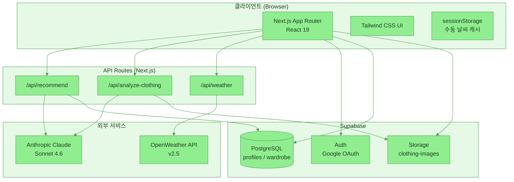
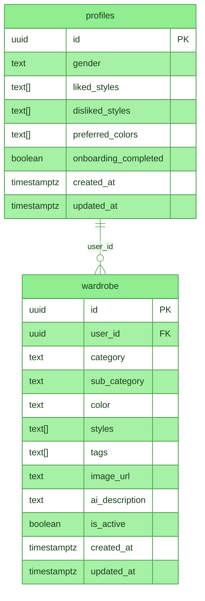
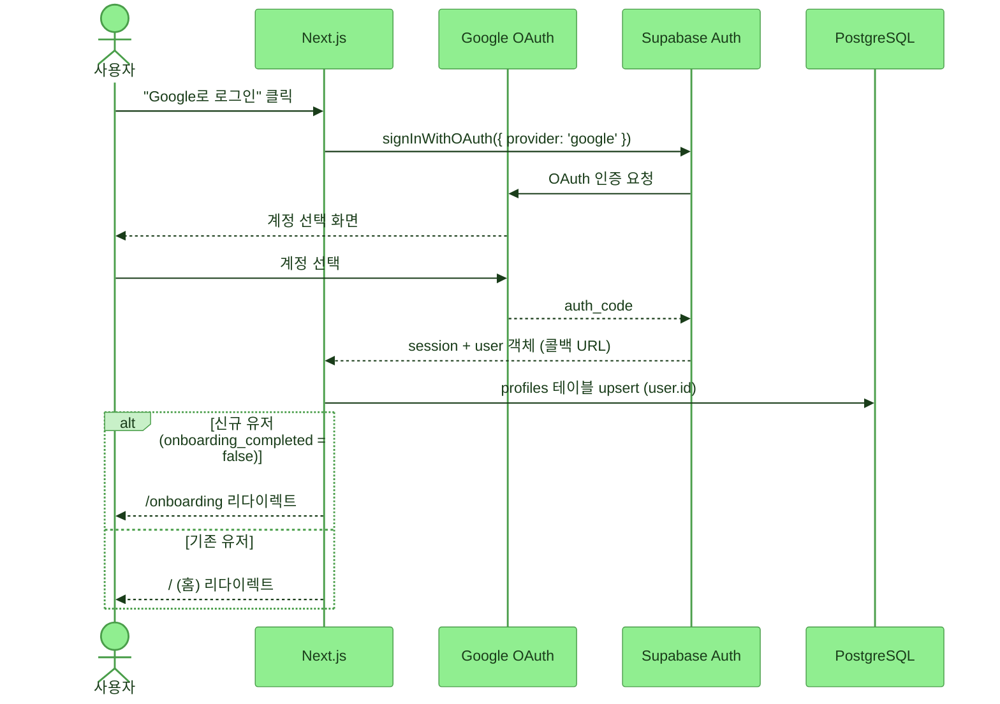
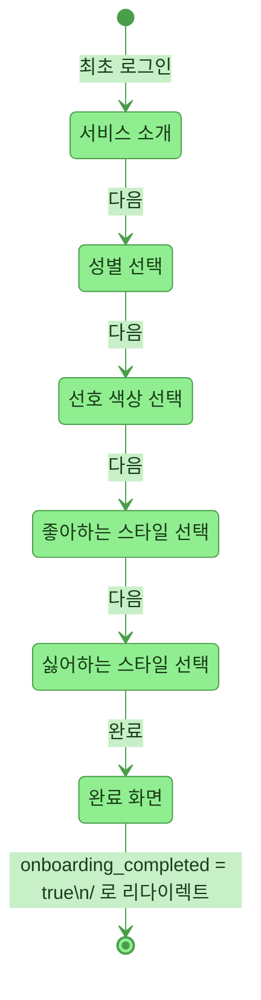
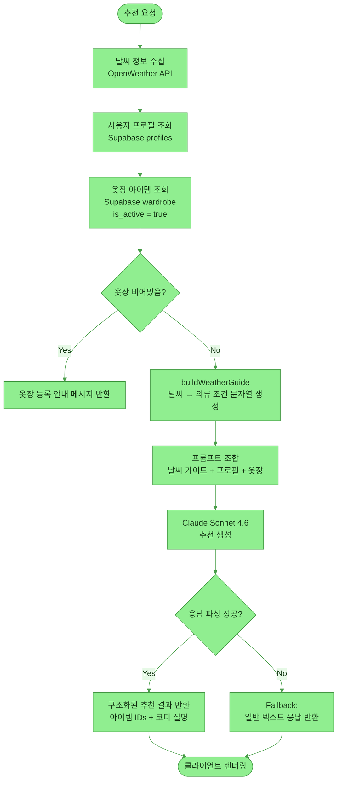

# 🌤️ 몇 도야? (myeotdoya) — 코드 이해 문서

**내 옷장에서 오늘의 날씨를, 오늘의 옷차림으로.** 👗

[](https://nextjs.org/)
[](https://www.typescriptlang.org/)
[](https://tailwindcss.com/)
[](https://supabase.com/)
[](https://anthropic.com/)
[](https://openweathermap.org/)
[](https://vercel.com/)

---

## 목차

1. [프로젝트 개요](#1-프로젝트-개요)
2. [시스템 아키텍처](#2-시스템-아키텍처)
3. [데이터베이스 스키마](#3-데이터베이스-스키마)
4. [인증 플로우](#4-인증-플로우)
5. [온보딩 플로우](#5-온보딩-플로우)
6. [추천 파이프라인](#6-추천-파이프라인)
7. [디렉터리 구조](#7-디렉터리-구조)
8. [환경 변수](#8-환경-변수)
9. [핵심 모듈 설명](#9-핵심-모듈-설명)
10. [주요 설계 결정](#10-주요-설계-결정)

---

## 1. 📋 프로젝트 개요

| 항목 | 내용 |
|------|------|
| **프레임워크** | Next.js 15 (App Router) |
| **언어** | TypeScript |
| **스타일링** | Tailwind CSS |
| **데이터베이스** | Supabase (PostgreSQL + Storage) |
| **인증** | Supabase Auth (Google OAuth) |
| **AI** | Anthropic Claude Sonnet 4.6 |
| **날씨** | OpenWeather API v2.5 |
| **배포** | Vercel |

사용자가 자신의 옷장을 등록하면, 현재 위치의 날씨와 개인 스타일 선호도를 바탕으로 AI가 오늘의 코디를 추천하는 웹 서비스.

---

## 2. 🏗️ 시스템 아키텍처



---

## 3. 🗄️ 데이터베이스 스키마



> [!NOTE]
> `is_active` 컬럼이 소프트 삭제 플래그 역할을 합니다. 행을 물리적으로 삭제하지 않고 `false`로 설정해 비활성화합니다. RLS 정책은 `is_active = true` 행만 노출합니다.

---

## 4. 🔐 인증 플로우



---

## 5. 👤 온보딩 플로우



온보딩은 `/onboarding` 단일 페이지에서 `step` 상태(0–5)로 관리됩니다. 각 스텝의 데이터는 로컬 `useState`에 누적되다가 마지막 스텝 완료 시 Supabase `profiles` 테이블에 한 번에 저장됩니다.

---

## 6. 🤖 추천 파이프라인



> [!TIP]
> `buildWeatherGuide(weather)` 함수는 기온·강수·바람 세기를 인간 친화적 텍스트로 변환합니다. 이 문자열이 Claude 프롬프트의 핵심 컨텍스트가 됩니다.

---

## 7. 📁 디렉터리 구조

```
weather/
├── src/
│   ├── app/
│   │   ├── (auth)/
│   │   │   └── login/              # Google OAuth 로그인 페이지
│   │   ├── api/
│   │   │   ├── analyze-clothing/   # 의류 이미지 AI 분석
│   │   │   ├── recommend/          # 코디 추천 (메인 AI 로직)
│   │   │   └── weather/            # 날씨 데이터 프록시
│   │   ├── onboarding/             # 온보딩 5단계 플로우
│   │   ├── wardrobe/
│   │   │   ├── add/                # 옷 등록 (이미지 업로드 + AI 분석)
│   │   │   └── [id]/               # 옷 상세/편집
│   │   ├── layout.tsx
│   │   └── page.tsx                # 홈 (날씨 + 추천 결과)
│   └── lib/
│       ├── supabase/
│       │   ├── client.ts           # 브라우저용 Supabase 클라이언트
│       │   └── server.ts           # 서버용 Supabase 클라이언트 (쿠키 기반)
│       └── weather-guide.ts        # buildWeatherGuide 함수
├── public/
├── .env.local                      # 환경 변수 (Git 제외)
├── next.config.ts
└── tailwind.config.ts
```

---

## 8. 🔑 환경 변수

| 변수 | 용도 | 사용 위치 |
|------|------|-----------|
| `NEXT_PUBLIC_SUPABASE_URL` | Supabase 프로젝트 URL | 클라이언트 + 서버 |
| `NEXT_PUBLIC_SUPABASE_ANON_KEY` | Supabase 익명 키 (RLS 적용) | 클라이언트 + 서버 |
| `SUPABASE_SERVICE_ROLE_KEY` | Supabase 서비스 롤 키 (RLS 우회) | 서버 전용 |
| `ANTHROPIC_API_KEY` | Claude API 키 | 서버 전용 |
| `OPENWEATHER_API_KEY` | OpenWeather API 키 | 서버 전용 |

> [!WARNING]
> `SUPABASE_SERVICE_ROLE_KEY`는 모든 RLS 정책을 우회합니다. 절대 클라이언트 코드에 노출해선 안 됩니다. API Route 내부에서만 사용하고 `.env.local`에만 보관하세요.

---

## 9. ⚙️ 핵심 모듈 설명

### `src/lib/supabase/client.ts`

브라우저에서 실행되는 컴포넌트용 Supabase 클라이언트를 생성합니다. `createBrowserClient`를 사용하며 세션은 쿠키로 관리됩니다.

### `src/lib/supabase/server.ts`

Server Component, API Route, Server Action에서 사용하는 서버 전용 클라이언트입니다. `createServerClient`로 쿠키를 직접 읽고 써서 세션을 유지합니다.

### `src/lib/weather-guide.ts`

`buildWeatherGuide(weather)` 함수가 정의되어 있습니다. OpenWeather 응답 객체를 받아 "현재 기온 22°C (체감 20°C), 맑음, 바람 약함" 형태의 사람이 읽기 좋은 날씨 컨텍스트 문자열을 반환합니다. 이 문자열이 Claude 추천 프롬프트에 삽입됩니다.

### `src/app/api/recommend/route.ts`

추천 파이프라인의 핵심 엔드포인트입니다.

1. 클라이언트에서 위도·경도를 받아 OpenWeather API를 호출합니다.
2. 로그인된 사용자의 `profiles`와 `wardrobe` (is_active = true) 를 조회합니다.
3. `buildWeatherGuide`로 날씨 컨텍스트를 생성하고 프롬프트를 조합합니다.
4. Claude Sonnet 4.6에게 추천을 요청하고 JSON 응답을 파싱해 반환합니다.

### `src/app/api/analyze-clothing/route.ts`

옷 등록 시 이미지를 분석하는 엔드포인트입니다.

1. 이미지를 Supabase Storage의 `clothing-images` 버킷에 업로드합니다.
2. 이미지 URL을 Claude에게 전달해 카테고리·색상·스타일 태그를 추출합니다.
3. 분석 결과를 `wardrobe` 테이블에 저장합니다.

### `src/app/page.tsx` (홈)

- 컴포넌트 마운트 시 Geolocation API로 위치를 수집합니다.
- 수동으로 날씨를 입력한 경우 `sessionStorage`에 캐싱해 재방문 시 유지합니다.
- 위치 또는 수동 날씨 데이터가 준비되면 `/api/recommend`를 호출합니다.

### `src/app/onboarding/page.tsx`

`step` 상태(0–5)로 다단계 온보딩 UI를 관리합니다. 각 스텝 데이터는 `useState`로 누적하다가 마지막 스텝에서 Supabase `profiles` 테이블에 한 번에 upsert합니다.

---

## 10. 💡 주요 설계 결정

### 🗑️ 소프트 삭제 (Soft Delete)

옷을 삭제할 때 행을 물리적으로 제거하지 않고 `is_active = false`로 설정합니다. AI 분석에 비용이 드는 이미지와 메타데이터를 보존하고, 향후 "삭제한 옷 복원" 기능을 위한 여지를 남기기 위함입니다. Supabase RLS 정책에서 `is_active = true` 필터를 적용해 일반 쿼리에는 비활성 행이 노출되지 않습니다.

### ⚡ 룰 기반 필터링과 Claude 위임의 분리

날씨 조건 해석(기온 범위, 강수 여부, 바람 세기)은 `buildWeatherGuide`에서 결정론적 룰로 처리합니다. Claude에게는 이미 해석된 텍스트만 전달합니다. 추천 로직(어떤 옷을 어떻게 조합하는지)만 Claude가 담당합니다. 이렇게 분리하면 날씨 해석 로직을 테스트하기 쉽고, Claude 프롬프트 변경 없이 날씨 조건을 수정할 수 있습니다.

### 🔄 Supabase 클라이언트 이중화

브라우저용(`createBrowserClient`)과 서버용(`createServerClient`)을 분리합니다. 서버 클라이언트는 Next.js `cookies()` API로 세션 쿠키를 직접 읽고 씁니다. 이렇게 하지 않으면 SSR 환경에서 세션이 유실됩니다.

### 💾 수동 날씨의 `sessionStorage` 캐싱

GPS를 허용하지 않는 사용자를 위한 수동 날씨 입력값을 `sessionStorage`에 저장합니다. `localStorage`를 쓰면 탭을 닫아도 유지되어 오래된 날씨 데이터로 잘못된 추천이 나올 수 있습니다. 세션 범위로 제한해 탭을 닫으면 자동으로 초기화됩니다.
